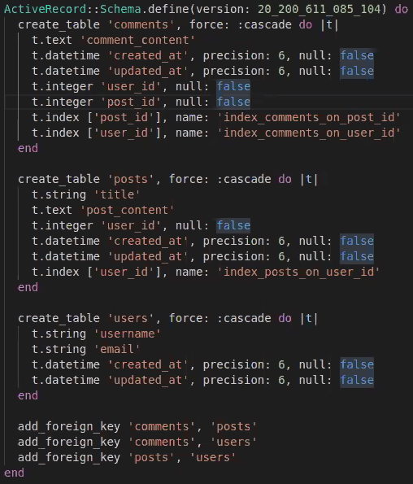

# Micro-reddit

> Small version of Micro-Reddit to check working on Active Records, models and Associations

This project is to check how active record, models, and associations works in Rails. This application is similar to Reddit (called Micro-Reddit) where a user can create a post and add comments to it.

## Built With

- Ruby
- Rails
- VSCode
- Git and Github

👤 **Azeem Ahmed**

- Github: [@Azeem838](https://github.com/Azeem838)

👤 **Rajkumar Das**

- Github: [@rajkumardas2701](https://github.com/rajkumardas2701)
- Twitter: [@Rajkuma58621299](https://twitter.com/Rajkuma58621299)
- Linkedin: [Rajkumar Das](https://www.linkedin.com/in/rajkumar-das-41308961/)

## 🤝 Contributing

Contributions, issues and feature requests are welcome!

Feel free to check the [issues page](https://github.com/rajkumardas2701/Micro-reddit1/issues).

## Show your support

Give a ⭐️ if you like this project!

